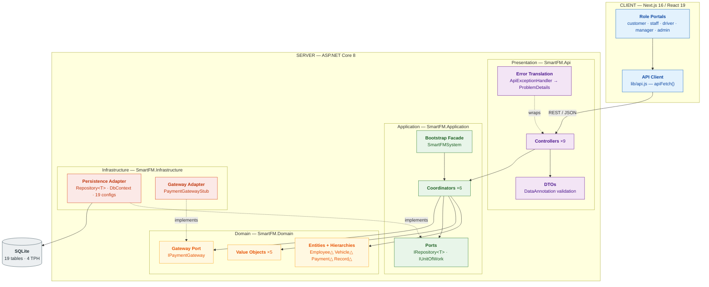

# Architecture Style

**SWE30003 Assignment 3 — Group 19** · Companion to `report.md` §3.3 · Addresses the *Architecture style(s)* criterion (10 marks)

Reference numbers match `report.md` §7.

---

## 1. Identified styles

Three styles compose, each governing a different axis:

| Axis | Style |
|---|---|
| Boundary between UI and business logic | **Client–Server** |
| Internal structure of the server | **Layered (strict, dependency-inverted)** [4] |
| Request handling | **Model–View–Controller** [4], View relocated across HTTP |

Only styles with direct evidence in the repository are claimed. The Observer/event-driven style described in Assignment 2 is **not** claimed — it is not in the delivered code. Components below are pitched **above class level**, as the brief requires: each groups several classes.

---

## 2. Component diagram

Solid arrows are dependencies or calls; dashed arrows are *implements*/*wraps*. **Both dashed arrows point upward**, from Infrastructure into ports declared above it — that inversion is the defining constraint of this architecture.

---

## 3. Connections and constraints

| Connector | Between | Mechanism | Constraint enforced |
|---|---|---|---|
| REST over HTTP | Client ↔ Controllers | JSON, CORS policy `"Frontend"` | Stateless; no business rule on the client; errors always arrive as RFC 7807 `ProblemDetails` |
| Method call | Controllers → Coordinators | Constructor injection | A controller calls **one** coordinator and never another controller |
| Method call | Coordinators → Domain | In-process | Coordinators orchestrate; invariants stay in entity constructors and methods |
| Port/adapter | Coordinators → `IRepository<T>`, `IPaymentGateway` | Interface above, implementation below | Application and Domain never name an EF Core or provider type |
| Factory delegate | `RecordCoordinator` → `FleetAssignmentCoordinator` | `Func<FleetAssignmentCoordinator>` | Breaks the one real coordinator cycle; resolved lazily |
| ORM | `Repository<T>` → SQLite | EF Core `DbSet<T>` | Schema knowledge confined to Infrastructure |

**The dependency rule**, verified from `.csproj` references rather than asserted:

| Project | References |
|---|---|
| `SmartFM.Domain` | *none — zero project and package references* |
| `SmartFM.Application` | Domain |
| `SmartFM.Infrastructure` | Domain, Application |
| `SmartFM.Api` | Application, Infrastructure |

Because Domain has no references at all, a business rule cannot depend on persistence, HTTP or a third-party library — the compiler enforces Dependency Inversion, not convention. `Api` → `Infrastructure` is the one deliberate exception, so `Program.cs` can register concrete adapters; no controller references an Infrastructure type.

**Runtime constraints.** Composition happens once at startup (`Program.cs` registers everything, then runs `Database.Migrate()`, `SeedData.SeedAsync()`, `SmartFMSystem.Start()`). Scope is per-request — coordinators and repositories are `AddScoped`, so each request gets its own `DbContext`. Transactions are explicit: one `SaveChangesAsync()` per business operation, with audit writes following.

**Exception-to-status mapping** — the intermediary connecting domain vocabulary to HTTP, on which every row of `test-cases.csv` depends:

| Domain signal | Status | Title |
|---|---|---|
| `ArgumentException` | 400 | Bad Request |
| `InvalidOperationException` containing *"not found"* | 404 | Not Found |
| any other `InvalidOperationException` | 409 | Conflict |
| anything else | 500 | Internal Server Error |

`ProblemDetails.Detail` carries the original exception message, which `lib/api.js` surfaces to the user.

---

## 4. Architecture mapping

| Style / pattern | Evidence | Purpose | Trade-off accepted | Quality |
|---|---|---|---|---|
| **Layered (strict)** [4] | Four projects; Domain has zero references | Isolate business rules from delivery and storage | More projects and mapping code | Modifiability, Testability |
| **Client–Server** | Next.js client over nine REST controllers | UI evolves independently; several portals on one API | Latency; clients go stale, hence 30 s polling | Modifiability, Usability |
| **MVC (View across HTTP)** [4] | Model = entities, Controller = `*Controller`, View = Next.js | Keep rendering off the server | Two languages and toolchains | Usability |
| **Service Layer** [6] | Six coordinators, one per business area | Every cross-object workflow gets a named owner | Coordinators grow — `FleetAssignmentCoordinator` is 513 lines | High Cohesion |
| **Repository** [6] | `IRepository<T>` in Application, `Repository<T>` in Infrastructure, open-generic | One persistence abstraction; enables in-memory SQLite tests | No `.Include()`/`IQueryable`, so coordinators do manual lookups and in-memory filtering | Testability |
| **Unit of Work** [6] | `IUnitOfWork` wrapping `SaveChangesAsync` | Make the commit boundary explicit | Callers must remember to save | Data integrity |
| **Dependency Inversion** | `IRepository<T>` and `IPaymentGateway` declared above, implemented below | Swap storage or payment provider without touching business code | Needs a DI container and composition root | Modifiability |
| **Facade** [3] | `SmartFMSystem` sequences six initialisers | Preserve A2's bootstrap contract as one entry point | Now thin — the container does the construction | Comprehensibility |
| **Strategy** [3] | `IPaymentGateway`; `Payment` → three TPH subclasses | Isolate payment variation | Only a stub exists, per the brief | Modifiability |

**Tactics applied** [5]: *restrict communication paths* (controllers reach the domain only through a coordinator; none touches a repository); *use an intermediary* (`IRepository<T>`, `IPaymentGateway`, `ApiExceptionHandler`); *abstract common services* (one open-generic repository for all 19 types); *validate at the boundary* then authoritatively in the domain; *defer binding* (adapters chosen in `Program.cs`); *maintain an audit trail* (`RecordStatusChangeAsync` after every transition).

---

## 5. Known weaknesses

1. **The generic repository leaks work upward.** `IRepository<T>` exposes only `GetByIdAsync`/`GetAllAsync`, so coordinators call `GetAllAsync()` and filter in memory. Correct at seed-data scale; it would not hold at the 500-vehicle scale of assumption A1.
2. **No authentication or authorisation exists.** Only the driver portal has a client-side `sessionStorage` guard; manager, staff, admin and customer routes are reachable by URL and the API has none at all. Assignment 1 listed authentication as a task — this is the largest gap between intended and delivered architecture.
3. **Two coordinators carry disproportionate weight** — `FleetAssignmentCoordinator` (513 lines) and `ReportingCoordinator` (474) — the god-class symptom heuristic H4 set out to avoid.
4. **Presentation and application decompositions no longer align.** `TrackingController` and `IncidentsController` remain separate although both delegate to `RecordCoordinator`: the controller-per-area split outlived the coordinator-per-area split.
