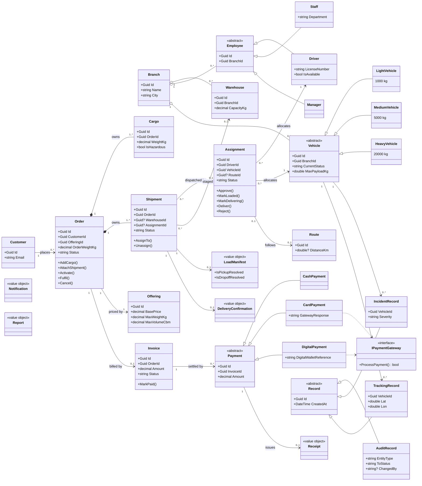
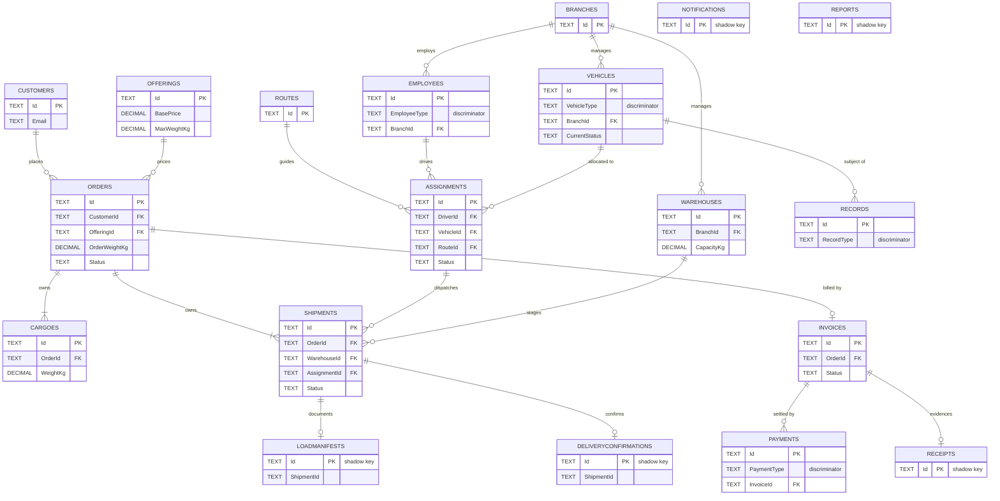

# SWE30003 Assignment 3 — Object Design Implementation and Reflection

**Smart Fleet Management System (SmartFM) for ABC-Trans**
**Group 19** — Le Mai Chi (105555880), Tran Minh Hai (105550542), Nguyen Nhat Lam (105553871), Nguyen Duc Nam (105544406)
SWE30003 Software Architectures and Design · Semester May 2026 · Lecturer: Dr. Le Minh Duc

| Marking criterion | Marks | Location |
|---|---:|---|
| Detailed OO design; changes and non-changes | 30 | §3, `design-revision.md` |
| Quality of the original Assignment 2 design | 20 | §4.1 |
| Lessons learnt | 10 | §4.2 |
| Architecture style(s) | 10 | `architecture-style.md`, summary §3.3 |
| Source code and coding standard | 20 | §5.1 |
| Compilation and correct execution | 30 | §5.2, `testing.md`, `test-cases.csv` |

> **Appendix A — the complete Assignment 2 submission — must be attached.** The brief awards zero for the design, discussion and reflection parts without it.

---

## 1. Introduction

SmartFM is a fleet and logistics system for ABC-Trans, a Vietnamese transport company operating across hubs in Hanoi and Ho Chi Minh City. Assignment 1 specified nine user tasks; Assignment 2 produced an implementation-free object design of 43 candidate classes using Responsibility-Driven Design.

This assignment takes that design to working software and reflects on it. The delivered system is an ASP.NET Core 8 REST API over a layered C# domain model with SQLite persistence, plus a Next.js client providing five role portals — customer, staff, driver, manager and administrator. Six areas of business operation are implemented end to end, exceeding the four required.

The relationship between the assignments is not a straight translation. Assignment 2 excluded persistence, UI and deployment by scope, so much of the detailed design covers concerns the original never addressed. Beyond those additions, twelve material changes were made — some correcting errors the marker identified, others forced by problems that surfaced only once the design met a compiler and a database.

**Method.** This report describes what the delivered system actually does, written by reverse-engineering the codebase and running the build and test suite. Assignment 2 and the marker's comments are the comparison baseline, never a description of the implementation; where they disagree, the code is the fact and the divergence is the finding.

---

## 2. Summary of design revision

In **`design-revision.md`**: twelve revisions with evidence and justification, eight non-changes, seven items to revisit, and traceability to the Assignment 2 mark sheet.

The three with the widest consequences: coordinators removed from the domain model but retained as an application layer; `Cargo` re-parented from `Shipment` to `Order`; and the one-order-to-one-shipment assumption broken so one assignment can carry many shipments.

---

## 3. Detailed design

### 3.1 Final class diagram

Generated from the delivered `SmartFM.Domain` source. It shows the **domain model only** — coordinators and `SmartFMSystem` are application-layer machinery, and the marker judged them *"unsuitable technical classes"* at this level; they appear in `architecture-style.md`. Attributes are limited to identity, foreign keys, status and business-significant fields so the diagram stays readable in print, answering the marker's note that the Assignment 2 diagram was *"too complex"*.



**Composition (`*--`) is now used only where one object owns another's lifetime** — an `Order` owns its `Cargo` and `Shipment`s. Everything else is aggregation or association. This directly corrects the marker's finding of *"several incorrect compositions"* on `Branch`, `Order`–`Invoice`, `Invoice`–`Payment`, `Shipment`, `Vehicle` and `Assignment`, a containment misuse Riel's heuristic H14 warns against [1].

**`Order` is the spine.** Created **Pending** → **Approved** on payment or assignment → **Active** when the assignment is approved → **Fulfilled** on delivery confirmation. **Cancelled** only from Pending or Approved and only if nothing is dispatched; `Order.Cancel(bool hasDispatchedShipment)` takes dispatch state as an argument rather than reaching for a repository, keeping the domain free of persistence.

**`Assignment` is the operational counterpart**, binding one driver, one vehicle, an optional route and one or more shipments: **Pending → Assigned → Loaded → Delivering → Delivered**, with **Rejected** available before delivery. Every transition is guarded inside the entity, so an illegal move throws regardless of the caller.

*[Figure C-1 — full-resolution class diagram, Appendix C]*

### 3.2 Changes and non-changes

#### 3.2.1 Class level

Full table in `design-revision.md`. Summary:

| Category | Classes |
|---|---|
| **Removed** | `MaintenanceRecord` (out of scope per marker), `ITrackable`, `Observer`/`ITelemetryObserver`, `TrackingCoordinator`, `IncidentCoordinator`, `TelemetrySimulator`, `TelemetryData`, `LineItem` |
| **Merged** | `TrackingCoordinator` + `IncidentCoordinator` → `RecordCoordinator` — both managed `Record` subtypes; one owner is more cohesive |
| **Added** | `IRepository<T>`, `IUnitOfWork`, `SmartFMDbContext`, `Repository<T>`, `UnitOfWork`, 19 EF configurations, `PaymentGatewayStub`, `SeedData`, 9 controllers, DTOs, `ApiExceptionHandler`, 5 status classes — all persistence and presentation, excluded from A2 by scope |
| **Renamed** | `PaymentGateway` → `IPaymentGateway`; `initializeXSubsystem()` → `InitializeXSubsystem()` (C# conventions; word sequence preserved) |
| **Re-parented** | `Cargo`: `ShipmentId` → `OrderId` — the marker's Scenario 1 correction |
| **Unchanged** | All four abstract hierarchies, `Branch`, `Warehouse`, `Customer`, `Offering`, `Order`, `Shipment`, `Assignment`, `Invoice`, `Route`, five value objects |

The re-parenting follows GRASP Information Expert and Creator as Larman states them [2]: the object holding the data should create it, and it is the `Order` — not a shipment leg created later — that knows what the customer is shipping.

**Attributes were entirely new work.** Assignment 2 specified responsibilities, not fields. Several encode business rules: `Offering.MaxWeightKg`/`MaxVolumeCbm` became the cargo validation ceiling, and `Vehicle.MaxPayloadKg` is fixed by the subclass constructor (1 000 / 5 000 / 20 000 kg), so capacity is expressed by type rather than by a conditional.

#### 3.2.2 Responsibility level

**Workflow responsibility left the entities.** A2's CRC cards gave `Staff` the responsibility to set up dispatch assignments and `Driver` to create delivery confirmations. Neither has those methods; the work lives in `FleetAssignmentCoordinator`, with the actor's identity passed as an argument (`actingStaffId`, `driverId`) and recorded in the audit trail. The reason is transactional — creating an assignment touches shipments, orders, a driver, a vehicle, a route and a warehouse, then commits once, and an entity cannot own that without reaching outside itself.

**Validation split in two.** Structural validation (required fields, ranges, email format) sits on request DTOs at the API boundary; business validation (offering limits, warehouse capacity, double-booking, status transitions) sits in the domain and coordinators, and is authoritative.

**Auditing is a responsibility A2 never assigned.** `RecordCoordinator.RecordStatusChangeAsync` runs after every lifecycle transition, recording entity, from-status, to-status and actor. It became the backbone of the manager notification feed and reporting. A2 modelled `AuditRecord` but never said who writes it.

**Distribution.** Assignment 2 invoked heuristic H4 against god classes [1]. Measured against the code:

| Coordinator | Lines | Assessment |
|---|---:|---|
| `FleetAssignmentCoordinator` | 513 | Assignment lifecycle, load manifest *and* delivery confirmation — arguably three responsibilities |
| `ReportingCoordinator` | 474 | Breadth, not depth; each method is small |
| `MasterDataCoordinator` | 378 | Five entity types, uniform CRUD |
| `OrderFulfilmentCoordinator` | 280 | Cohesive |
| `RecordCoordinator` | 182 | Audit plus incidents |
| `BillingCoordinator` | 146 | Cohesive |

Honestly read, `FleetAssignmentCoordinator` shows early god-class symptoms: the load-manifest workflow is a coherent sub-responsibility that could have been extracted and was not.

`RecordCoordinator` and `FleetAssignmentCoordinator` are mutually dependent — the fleet coordinator writes audit records, the record coordinator needs fleet operations when an incident affects an assignment. The cycle is broken by injecting `Func<FleetAssignmentCoordinator>` and resolving lazily. A pragmatic fix; domain events would be cleaner.

#### 3.2.3 Dynamic aspects

**Bootstrap.** Assignment 2's sequence and naming contract survived. `SmartFMSystem.Start()` calls the subsystems in the original order:

```
1. InitializeMasterDataSubsystem()   4. InitializeRecordSubsystem()   ← was two steps in A2
2. InitializeOrderSubsystem()        5. InitializeBillingSubsystem()
3. InitializeFleetSubsystem()        6. InitializeReportingSubsystem()
```

What changed is *who constructs the objects*. In A2, `SmartFMSystem` was the Creator, instantiating coordinators as Singletons. Now the DI container constructs everything from `Program.cs`, and `Start()` only sequences the initialisers. Coordinators are registered `AddScoped`, because each HTTP request needs its own `DbContext` and unit of work — a process-wide singleton holding a scoped context would be incorrect under concurrency, so A2's Singleton justification no longer applies.

**Scenario changes.**

- **S1 (place order)** lost its warehouse-selection step. The customer now supplies only pickup and delivery addresses; staff set the warehouse at assignment creation, where the capacity check moved. **The A2 sequence diagram for S1 no longer matches the code** and should be annotated in Appendix A.
- **S2 and S4 (tracking)** no longer flow through `ITrackable`; order status is read via `GET /api/orders/{id}`. Live telemetry is descoped.
- **S5 (manifest)** became stricter — a per-item checklist gating trip start, plus damaged-item capture at drop-off feeding the `DeliveryConfirmation`.

Primary runtime workflow:

```
Customer → POST /api/orders → PlaceOrderAsync
    validate cargo vs Offering → find-or-create Customer → Order + Shipment + Invoice
    → AddCargo (recomputes OrderWeightKg) → save → audit(Order: null → Pending)

Staff → POST /api/fleet/assignments → CreateAssignmentAsync
    reject assigned shipments / check capacity / reject double-booking
    → Assignment; Shipment Assigned; Order Approved; driver+vehicle held → audit ×3

Staff → .../approve        → Assignment Assigned, Order Active
Driver → load manifest → start-trip → Assignment Loaded → Delivering
Driver → .../delivery-confirmation  → all Delivered, Order Fulfilled, resources released
```

*[Figure C-2 — bootstrap sequence diagram]* · *[Figure C-3 — order-to-fulfilment sequence diagram]*

### 3.3 Architecture style — summary

Full treatment in **`architecture-style.md`**. Three styles compose, all described by Buschmann et al. [4]: **Client–Server** across the HTTP boundary, **strict Layered** inside the server, and **MVC** with the View relocated to the Next.js client. The persistence patterns follow Fowler [6]; the tactics holding the layers apart are those catalogued by Bass et al. [5].

The layering is enforced by the compiler, not convention: `SmartFM.Domain` has **zero project and package references**, so a business rule cannot depend on persistence or HTTP. `Application` references only `Domain`; `Infrastructure` implements interfaces declared above it; `Api` composes both in `Program.cs`. Assignment 2 claimed a Layers architecture — the implementation is where that claim became checkable.

The Observer/event-driven style A2 described is **not** claimed, because it is not in the code.

---

## 4. Design quality

### 4.1 Evaluation of the Assignment 2 design

Assignment 2 scored **78/100**. Marker comments are quoted from the mark sheet.

**Addressed adequately.** All four abstract hierarchies went into code unchanged and mapped cleanly onto EF table-per-hierarchy discriminators. `Vehicle` is the strongest case: because each subclass fixes `MaxPayloadKg`, capacity is expressed by type and no conditional on vehicle class appears anywhere. The **bootstrap** was specific enough to implement literally (4.5/5). **Value objects** were correctly identified and map onto C# `record` types.

The **coordinator decomposition was the right decomposition at the wrong level**. The marker rejected them as domain classes — *"Unsuitable technical classes (not a concern at this stage): SmartFMSystem, coordinator classes"* — correctly for an object-design deliverable. But the seams held: six of seven survive one-to-one in the application layer, and the API grew a controller per business area along the same lines.

**Missing from Assignment 2.**

| Gap | Consequence |
|---|---|
| Persistence (`PersistenceManager` discarded by scope) | The whole repository/unit-of-work design, transaction boundaries and value-object mapping landed unexamined during implementation |
| User interface | Drove real domain change — the warehouse-selection removal came from asking who should actually make that decision, a question only a concrete UI forces |
| Attributes | Several turned out to carry business rules (`Offering.MaxWeightKg`) |
| Error handling | No CRC card addresses failure; a whole domain-to-HTTP mapping was needed |
| **Authentication and authorisation** | Listed as a task in Assignment 1, never modelled, still unimplemented — **the most significant gap** between intended and delivered |
| Concurrency | `EnsureNotDoubleBookedAsync` does a read-then-write with no locking, so a genuine race remains |

**Errors introduced.**

| Error | Marker's comment | Confirmed by implementation |
|---|---|---|
| Coordinators in the domain diagram | *"unsuitable technical classes"*; *"several unneeded associations"*; diagram *"too complex"* | Belonged one layer up |
| Misused composition (six listed) | *"several incorrect compositions"* | Cascade delete made it unavoidable — a `Vehicle` outlives any `Assignment` |
| Out-of-scope modelling | *"Vehicle maintenance: not listed as part of the scope"* | Described a subsystem nobody asked for |
| `Cargo` under `Shipment` | *"Cargo should be created from Order (not Shipment)"* | Once one order spans several shipments, cargo under a shipment forces duplicated declarations |
| Assumption A6 (1 order → 1 route) | 3/5 on Assumptions; five of eleven were really constraints | Reversed in commit `319c6ab`; 1:1 could not express a consolidated dispatch |
| CRC/diagram inconsistency | *"(Driver → \*) has 2 collaborators but 4 associations"* | Two artefacts maintained separately drifted |

**Interpretation required** was substantial in four areas: **status vocabularies** — A2 named states informally, so five complete vocabularies and every legal transition had to be invented; **transaction boundaries** — A2 said which object does what, never what commits together; **who acts** — CRC cards assigned responsibilities to `Staff`/`Driver`, but in a request-response system the actor is a caller, hence the `actingStaffId` parameters; and **interface semantics** — `ITrackable` had no meaningful implementation without a telemetry source, which is why it was removed rather than built. Being *"strictly implementation-free"* was correct for the deliverable but made the design-to-code gap wider than it appeared.

### 4.2 Lessons learnt

**Model relationship strength by asking about deletion.** *If I delete A, must B cease to exist?* Only `Order`→`Cargo` and `Order`→`Shipment` pass. Asking that of each diamond in Assignment 2 would have saved the H14 marks.

**Separate "assumption" from "constraint" deliberately.** Five of eleven assumptions were really constraints. A constraint is given; an assumption is a choice that can be revisited. A6 was filed as an assumption but treated as a constraint, so nobody questioned it until the 1:1 model broke.

**Keep technical scaffolding out of the domain model — but keep the decomposition.** The coordinators were rejected as domain classes, yet what they encoded was sound. Next time we would present a domain model and an architecture view as separate diagrams, which is also what the marker's advice to *"make use of sub-diagrams"* implies.

**A design that excludes persistence hides real decisions.** Aggregate boundaries, transaction boundaries and the multiplicity errors were all discovered by building a schema. Even a sketch of the data model during Assignment 2 would have exposed the `Cargo` parenting error and A6 much earlier.

**Do not design for infrastructure that will not exist.** Observer, `ITrackable` and `TelemetrySimulator` answered a problem the project never had — there was no live vehicle feed. Check that a pattern has a real producer and consumer before designing around it, and treat removing one as a legitimate outcome.

**Generate diagrams from code once code exists.** The CRC-versus-diagram inconsistencies came from maintaining two artefacts by hand; the diagram in §3.1 is generated from source and cannot drift.

**A cheap abstraction can be an expensive one.** The generic `IRepository<T>` was quick to build but pushed filtering into the coordinators, several of which now filter in memory — fine at seed-data scale, not at the 500-vehicle fleet of assumption A1. The moment to notice was when the second coordinator wrote the same in-memory filter.

---

## 5. Implementation and testing

### 5.1 Mapping design to code

| Assignment 2 element | Implementation | Location |
|---|---|---|
| `SmartFMSystem` (Facade) | Six `Initialize*Subsystem()` calls | `backend/SmartFM.Application/SmartFMSystem.cs` |
| Seven coordinators | Six; Tracking + Incident merged | `backend/SmartFM.Application/Coordinators/` |
| Entities and hierarchies | 22 entity classes, four hierarchies, five status classes | `backend/SmartFM.Domain/Entities/` |
| `Record` hierarchy | `Audit`, `Incident`, `Tracking` | `backend/SmartFM.Domain/Records/` |
| Value objects | Five C# `record` types | `backend/SmartFM.Domain/ValueObjects/` |
| `PaymentGateway` | `IPaymentGateway` + `PaymentGatewayStub` | `Domain/Interfaces/`, `Infrastructure/Services/` |
| *(new)* Persistence | `IRepository<T>`, `IUnitOfWork`, `SmartFMDbContext`, 19 EF configurations | `Application/Abstractions/`, `Infrastructure/Persistence/` |
| *(new)* REST API | Nine controllers with DTOs | `backend/SmartFM.Api/Controllers/`, `Dtos/` |
| *(new)* Error translation | `ApiExceptionHandler` → RFC 7807 | `backend/SmartFM.Api/ErrorHandling/` |
| *(new)* UI | Five role portals | `frontend/src/app/` |
| `ITrackable`, `Observer`, `MaintenanceRecord`, `TelemetrySimulator` | **Not implemented** — descoped | — |

#### Database design

Nineteen tables from `SmartFMDbContext`; four use table-per-hierarchy inheritance. Keys and discriminators shown; descriptive columns omitted for print readability.



**Value objects have no natural identity**, so `Receipt`, `LoadManifest`, `DeliveryConfirmation`, `Notification` and `Report` use an EF *shadow* primary key, keeping the database concern out of the domain type. Collections inside value objects (`LoadManifest.CargoIds`) are stored as JSON via value converters — the source of the two `CS8603` build warnings.

*[Figure C-5 — full ER diagram with all columns, Appendix C]*

#### Coding standard

| Codebase | Standard | Reference |
|---|---|---|
| Backend (C#) | Microsoft C# Coding Conventions; .NET Framework Design Guidelines | [7], [8] |
| Frontend (JS/React) | ESLint with `eslint-config-next` | [9] |

Conformance, verified by inspection: **naming** — PascalCase types and methods, `_camelCase` private fields, `I`-prefixed interfaces, `Async` suffixes (this is why A2's `initializeOrderSubsystem()` became `InitializeOrderSubsystem()`); **encapsulation** — private setters with a private parameterless constructor for EF, state changed only through intention-revealing methods (`Approve()`, `Fulfil()`); **guard clauses** — `ArgumentNullException.ThrowIfNull` and explicit range checks at constructor entry; **file organisation** — one public type per file, folder-aligned namespaces; **modern features** — file-scoped namespaces, `record` types, pattern-matching switch expressions; **comments** — sparse, reserved for non-obvious rationale.

One inconsistency recorded honestly: the frontend mixes `.jsx`, `.tsx`, `.js` and `.ts`, so TypeScript is configured but only partially adopted.

### 5.2 Compilation and execution

Platform: macOS (Apple Silicon), .NET 8, Next.js 16, SQLite, Visual Studio Code with the C# Dev Kit. Run with `dotnet run --project backend/SmartFM.Api` and `npm run dev` in `frontend/`; the API migrates and seeds on startup. Full detail in `testing.md` §2–4.

```
Build succeeded.  0 Error(s), 2 Warning(s)
Passed!  - Failed: 0, Passed: 83, Skipped: 0, Total: 83
```

Both warnings are `CS8603` in EF value-converter lambdas and do not affect behaviour. *[Screenshots D-1, D-2]*

### 5.3 Testing

Detail in **`testing.md`**; record in **`test-cases.csv`**.

- **Six business areas** implemented end to end — order fulfilment, fleet assignment and delivery, billing, master data, incident reporting, reporting and audit — exceeding the four required, with the dependency chain closed rather than stubbed.
- **83 automated tests pass**, run against real in-memory SQLite rather than mocked repositories, so EF mapping and discriminators are exercised alongside business rules.
- **65 recorded test cases** covering valid input, invalid input, change-of-mind paths and successful completion. Every *Expected Output* is quoted from source; rows needing a screenshot from a running UI are marked *To verify* rather than assumed to pass.
- **All six A2 scenarios re-verified**, with deviations stated: S4 descoped, S3 missing the Hours-of-Service check, S1 and S5 changed by design.

---

## 6. Conclusion

Assignment 2 produced a design that was, in its essentials, right. Its four abstract hierarchies went into code untouched; its coordinator decomposition became the application layer and then the shape of the REST API; its bootstrap sequence was specific enough that `SmartFMSystem.Start()` follows it call for call, adjusting only the casing. For a design written without a compiler, a database or a screen, that is a considerable amount surviving contact with all three.

What did not survive is as instructive. The errors the marker identified were real, and implementation confirmed each independently: `Cargo` did belong to `Order`, the compositions were associations, and vehicle maintenance was outside scope. Assumption A6 was costliest, because it was recorded as an assumption but treated as a constraint, and its 1:1 relationships could not express something as ordinary as consolidating orders onto one vehicle. The most striking deletion was the telemetry subsystem: `ITrackable`, the `Observer` contract and `TelemetrySimulator` were a well-formed answer to a problem the system never had, and once it was clear no live vehicle feed would exist, the honest response was to remove them rather than build machinery with no producer.

Three lessons generalise. Relationship strength should be settled by a concrete question — *if I delete A, must B cease to exist?* — which alone resolves every composition error found. Excluding persistence from an object design conceals decisions rather than deferring them, since aggregate and transaction boundaries and the multiplicity errors all surfaced the moment a schema existed. And a design artefact and its code should not be maintained independently, which is why the diagram in §3.1 is generated from source.

The delivered system covers six business areas, compiles without error and passes 83 tests against a real database. It is also incomplete in ways worth naming: no authentication anywhere in the API despite Assignment 1 listing it; `FleetAssignmentCoordinator` showing the god-class symptoms the design set out to avoid; a generic repository that filters in memory in a way that would not hold at the case study's stated scale; and the Hours-of-Service check the marker asked for, never implemented. These are recorded because a reflection reporting only successes would be the less useful document.

---

## 7. References

[1] A. J. Riel, *Object-Oriented Design Heuristics*. Reading, MA: Addison-Wesley, 1996. — §3.1, §3.2.2, §4.1 (heuristics H14, H4).

[2] C. Larman, *Applying UML and Patterns*, 3rd ed. Upper Saddle River, NJ: Prentice Hall, 2005. — §3.2.1 (GRASP Information Expert, Creator).

[3] E. Gamma, R. Helm, R. Johnson, and J. Vlissides, *Design Patterns: Elements of Reusable Object-Oriented Software*. Boston, MA: Addison-Wesley, 1994. — `architecture-style.md` §4 (Facade, Strategy).

[4] F. Buschmann, R. Meunier, H. Rohnert, P. Sommerlad, and M. Stal, *Pattern-Oriented Software Architecture, Volume 1*. New York, NY: Wiley, 1996, ch. 2, pp. 31–52, 125–143. — §3.3 (Layers, MVC).

[5] L. Bass, P. Clements, and R. Kazman, *Software Architecture in Practice*, 3rd ed. Upper Saddle River, NJ: Addison-Wesley, 2013. — §3.3, `architecture-style.md` §5 (architectural tactics).

[6] M. Fowler, *Patterns of Enterprise Application Architecture*. Boston, MA: Addison-Wesley, 2003. — §3.3, `architecture-style.md` §4 (Repository, Unit of Work, Service Layer).

[7] Microsoft, "C# Coding Conventions," *.NET Documentation*, 2024. [Online]. Available: https://learn.microsoft.com/en-us/dotnet/csharp/fundamentals/coding-style/coding-conventions — §5.1.

[8] K. Cwalina, J. Barton, and B. Abrams, *Framework Design Guidelines*, 3rd ed. Boston, MA: Addison-Wesley, 2020. — §5.1.

[9] Vercel, "ESLint Configuration — `eslint-config-next`," *Next.js Documentation*, 2025. [Online]. Available: https://nextjs.org/docs/app/api-reference/config/eslint — §5.1.

[10] Group 19, "SWE30003 Assignment 2 — Object Design," Swinburne University of Technology, July 2026. — Appendix A; baseline for §3 and §4.

---

## 8. Appendices

**Appendix A — Assignment 2 submission.** The complete submission [10] (`Assignment2_Group19-1.pdf`, 66 pages) is attached in full, with the mark sheet and comments used in §4. *Required — the brief awards zero for design and reflection without it.*

**Appendix B — API endpoint reference.** `[Table B-1]` — generate from `http://localhost:5000/swagger/v1/swagger.json`. Endpoint families: `/api/orders`, `/api/customers`, `/api/fleet`, `/api/billing`, `/api/incidents`, `/api/master-data`, `/api/reports`, `/api/audit`, `/api/tracking`.

**Appendix C — Complete UML.** `[C-1]` class diagram at full resolution · `[C-2]` bootstrap sequence · `[C-3]` order-to-fulfilment sequence · `[C-4]` assignment and delivery sequence · `[C-5]` full ER diagram.

**Appendix D — Execution screenshots.**

| Ref | Content | Ref | Content |
|---|---|---|---|
| D-1 | Build succeeding, 0 errors | D-8 | Manifest refusing early trip start |
| D-2 | 83/83 tests passing | D-9 | Trip started, shipment InTransit |
| D-3 | Order form, empty state | D-10 | Delivery confirmed, order Fulfilled |
| D-4 | Order form validation message | D-11 | Invoice paid, receipt issued |
| D-5 | Order created, status Pending | D-12 | Duplicate branch name refused |
| D-6 | Double-booked driver refused | D-13 | Master data edit and delete |
| D-7 | Assignment approved, order Active | D-14 | Manager dashboard and audit feed |

A narrated screen recording may replace D-3 to D-14, as the brief permits.

**Appendix E — Repository structure.**

```
backend/
  SmartFM.Domain/          zero dependencies — Entities/ Records/ ValueObjects/ Interfaces/
  SmartFM.Application/     → Domain — Coordinators/ Abstractions/ SmartFMSystem.cs
  SmartFM.Infrastructure/  → Domain+Application — Persistence/ Migrations/ Seed/ Services/
  SmartFM.Api/             → Application+Infrastructure — Controllers/ Dtos/ ErrorHandling/ Program.cs
  SmartFM.Tests/           83 xUnit tests on in-memory SQLite
frontend/src/              app/ (orders staff driver manager admin map) · components/ · lib/api.js
concise/                   report.md · design-revision.md · architecture-style.md · testing.md
docs/test-cases.csv
```

**Appendix F — Outstanding items.**

| # | Item |
|---|---|
| F1 | **Attach the complete Assignment 2 submission as Appendix A** — mandatory |
| F2 | Capture screenshots D-1 to D-14, or record the narrated walkthrough |
| F3 | Complete the *Actual Output* column for `test-cases.csv` rows 62–65 |
| F4 | Decide on the Hours-of-Service check — implement, or state the descoping |
| F5 | Remove stale `TelemetrySimulator` paragraphs from `README.md` (deleted in `b663e2a`) |
| F6 | Confirm the telemetry-removal rationale — the commit message is bare |
| F7 | Export Mermaid diagrams to images for the printed PDF |
| F8 | Reconcile `domainentities.drawio.xml` with the final class diagram |
