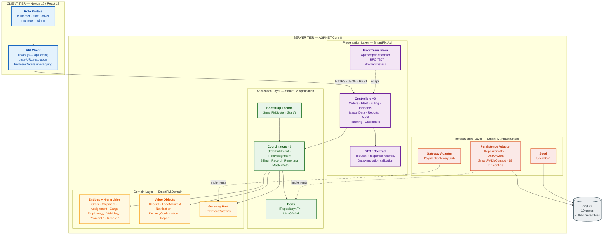

# Architecture Style

**SWE30003 Assignment 3 — Group 19**
Companion to `report.md` §3.3. Addresses the brief's *Architecture style(s) of your system design* criterion (10 points).

---

## 1. Identified styles

The delivered system is not a single-style system. Three styles compose, each governing a different axis:

| Axis | Style |
|---|---|
| Process boundary between UI and business logic | **Client–Server** |
| Internal structure of the server | **Layered (strict, dependency-inverted)** [4] |
| Request handling within a layer | **Model–View–Controller** [4], with the View relocated across the HTTP boundary |

Reference numbers throughout this document match the reference list in `report.md` §7.

Only styles with direct evidence in the repository are claimed. In particular, the Observer/event-driven style described in Assignment 2 is **not** claimed, because it is not present in the delivered code (see `docs/design-revision.md`, revision 10).

Components below are pitched **above class level**, as the brief requires — each component groups several classes.

---

## 2. Component diagram

Solid arrows are compile-time dependencies or runtime calls. Dashed arrows are *implements* / *wraps* relationships — note that both dashed arrows point **upward**, from Infrastructure into ports declared in the layers above. That inversion is the defining constraint of this architecture.

---

## 3. Connections and constraints

### 3.1 Connector inventory

| Connector | Between | Mechanism | Constraint enforced |
|---|---|---|---|
| REST over HTTP | API Client ↔ Controllers | JSON request/response, CORS policy `"Frontend"` | Stateless; the client holds no business rule. Every server error arrives as RFC 7807 `ProblemDetails` |
| Direct method call | Controllers → Coordinators | Constructor-injected instance | A controller may call **one** coordinator and may not call another controller |
| Direct method call | Coordinators → Domain | In-process | Coordinators orchestrate; they never contain domain invariants — those live in entity constructors and methods |
| Port / adapter | Coordinators → `IRepository<T>` / `IPaymentGateway` | Interface declared *above*, implemented *below* | The Application and Domain layers never name an EF Core or provider type |
| Factory delegate | `RecordCoordinator` → `FleetAssignmentCoordinator` | `Func<FleetAssignmentCoordinator>` | Breaks the one genuine circular dependency between coordinators; resolved lazily at call time |
| ORM mapping | `Repository<T>` → SQLite | EF Core `DbSet<T>`, Fluent configurations | All schema knowledge is confined to `SmartFM.Infrastructure` |

### 3.2 The dependency rule

The layering is **strict and inward-pointing**, verified from the `.csproj` project references rather than asserted:

| Project | References |
|---|---|
| `SmartFM.Domain` | *(none — zero project references, zero NuGet packages)* |
| `SmartFM.Application` | Domain |
| `SmartFM.Infrastructure` | Domain, Application |
| `SmartFM.Api` | Application, Infrastructure |

Because `SmartFM.Domain` has no references at all, a domain rule cannot accidentally depend on persistence, HTTP, or a third-party library. This is the concrete, checkable form of the Dependency Inversion Principle in this system: the compiler enforces it, not convention.

`SmartFM.Api` referencing `SmartFM.Infrastructure` is the one deliberate exception — it exists solely so `Program.cs` can register concrete adapters in the DI container at composition time. No controller references an Infrastructure type.

### 3.3 Runtime constraints

- **Composition happens once, at startup.** `Program.cs` registers the generic repository, `IUnitOfWork`, `IPaymentGateway`, the six coordinators and `SmartFMSystem`, then runs `Database.Migrate()`, `SeedData.SeedAsync()`, and `SmartFMSystem.Start()`.
- **Scope is per-request.** Coordinators and repositories are registered `AddScoped`, so each HTTP request gets its own `DbContext` and its own unit of work. This is what replaced Assignment 2's Singleton decision.
- **Transactions are explicit.** A coordinator mutates entities through repositories and then calls `IUnitOfWork.SaveChangesAsync()` exactly once per business operation; audit writes follow the save.

---

## 4. Architecture mapping table

| Style / pattern | Evidence in this repository | Purpose | Trade-offs accepted | Quality attribute |
|---|---|---|---|---|
| **Layered (strict)** [4] | Four projects; `SmartFM.Domain.csproj` has zero references | Isolate business rules from delivery and storage concerns | More projects, more indirection, more mapping code than a single-project app | Modifiability, Testability |
| **Client–Server** | Next.js client calling nine REST controllers across CORS | Let the UI evolve independently and support several role portals over one API | Network latency; the client can go stale, which is why the notifications feed polls every 30 s | Modifiability, Usability |
| **MVC (View across HTTP)** [4] | Model = domain entities; Controller = `*Controller`; View = Next.js pages | Keep rendering out of the server entirely | Two languages and two toolchains to maintain | Modifiability, Usability |
| **Service Layer** [6] | Six coordinators, each owning one business area | Give every cross-object workflow a single named owner, so workflow logic does not accumulate in entities | Coordinators can grow large — `FleetAssignmentCoordinator` is 513 lines | High Cohesion, Maintainability |
| **Repository** [6] | `IRepository<T>` declared in Application, `Repository<T>` implemented in Infrastructure, registered open-generically | One persistence abstraction for every aggregate; enables in-memory SQLite tests | The generic CRUD interface has no `.Include()`/`IQueryable`, so coordinators resolve related data with manual lookups and some in-memory filtering | Testability, Modifiability |
| **Unit of Work** [6] | `IUnitOfWork` → `UnitOfWork` wrapping `DbContext.SaveChangesAsync` | Make the commit boundary of a business operation explicit | Callers must remember to save; nothing enforces it | Reliability, Data integrity |
| **Dependency Inversion** | Both `IRepository<T>` and `IPaymentGateway` are declared above and implemented below | Allow storage and payment provider to be swapped without touching business code | Requires a DI container and a composition root | Modifiability, Testability |
| **Facade** [3] | `SmartFMSystem` sequences six `Initialize*Subsystem()` calls | Preserve the Assignment 2 bootstrap contract as a single entry point | Now thin, since the DI container performs the actual construction | Comprehensibility |
| **Strategy** [3] | `IPaymentGateway`; `Payment` → `Cash`/`Card`/`Digital` via TPH | Isolate payment variation behind one contract | Only a stub implementation exists, per the brief | Modifiability |
| **Centralised error translation** | `ApiExceptionHandler : IExceptionHandler`, `AddProblemDetails()`, `UseExceptionHandler()` | Map domain exceptions to HTTP once, in one place | Routing depends on exception *type*, plus a string match on `"not found"` | Reliability, Usability |

### Exception-to-status mapping

The intermediary that connects domain vocabulary to HTTP vocabulary is worth stating explicitly, because every row of `docs/test-cases.csv` depends on it:

| Domain signal | HTTP status | `ProblemDetails.Title` |
|---|---|---|
| `ArgumentException` (including `ArgumentNullException`) | 400 | `Bad Request` |
| `InvalidOperationException` whose message contains *"not found"* | 404 | `Not Found` |
| any other `InvalidOperationException` | 409 | `Conflict` |
| anything else | 500 | `Internal Server Error` |

`ProblemDetails.Detail` always carries the original exception message, which is what `lib/api.js` surfaces to the user.

---

## 5. Architectural tactics applied

The tactics below are named as catalogued by Bass, Clements and Kazman [5].

| Tactic | Realisation |
|---|---|
| **Restrict communication paths** | Controllers may only reach the domain through a coordinator; no controller touches a repository or `DbContext` |
| **Use an intermediary** | `IRepository<T>` between business logic and EF Core; `IPaymentGateway` between billing and any external provider; `ApiExceptionHandler` between domain exceptions and HTTP |
| **Abstract common services** | One open-generic `Repository<T>` serves all 19 persisted types |
| **Validate input at the boundary** | DataAnnotations on request DTOs, then domain guard clauses (`ArgumentException.ThrowIfNullOrWhiteSpace`, positive-value checks) as the authoritative rule |
| **Defer binding** | All concrete adapters are chosen in `Program.cs` at startup, not at compile time inside business code |
| **Maintain an audit trail** | `RecordCoordinator.RecordStatusChangeAsync` writes an `AuditRecord` after every lifecycle transition |

---

## 6. Known architectural weaknesses

Stated plainly, since the brief rewards honest reflection over advocacy.

1. **The generic repository leaks work upward.** `IRepository<T>` exposes only `GetByIdAsync`/`GetAllAsync`, so coordinators frequently call `GetAllAsync()` and filter in memory (for example `FleetAssignmentCoordinator.GetAssignmentsAsync`). Correct at seed-data scale; it would not hold at the 500-vehicle scale assumption A1 describes.
2. **No authentication or authorisation component exists.** Only the driver portal has a client-side `sessionStorage` guard; manager, staff, admin and customer routes are reachable by URL, and the API has no auth at all. Assignment 1 listed authentication as a task, and Assignment 2 did not model it — this is the largest gap between the intended and delivered architecture.
3. **Two coordinators carry disproportionate weight** — `FleetAssignmentCoordinator` (513 lines) and `ReportingCoordinator` (474 lines) — which is the god-class symptom Assignment 2's heuristic H4 set out to avoid.
4. **The controller-per-area split outlived the coordinator-per-area split.** `TrackingController` and `IncidentsController` remain separate although both now delegate to `RecordCoordinator`, so the presentation and application decompositions no longer align exactly.
