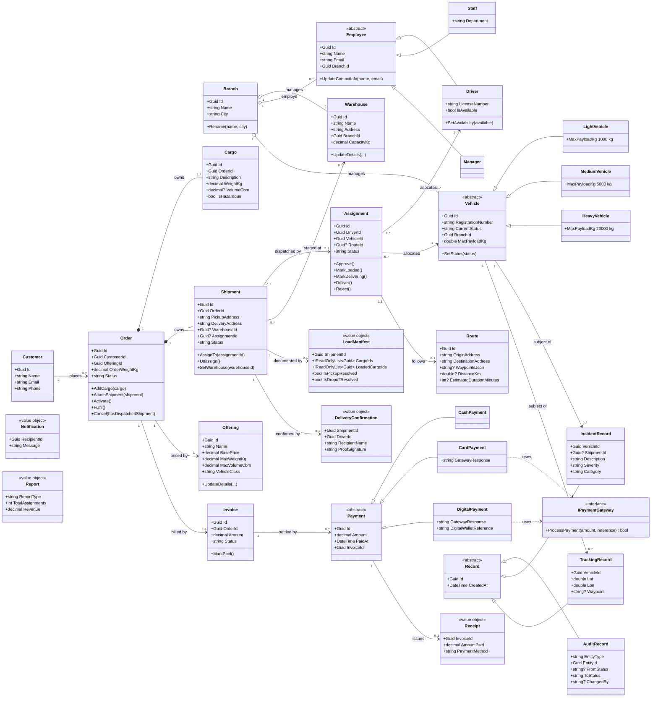
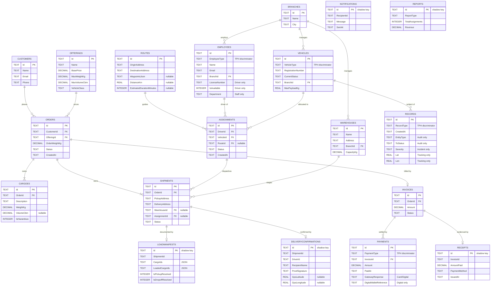

# SWE30003 Assignment 3 — Object Design Implementation and Reflection

**Smart Fleet Management System (SmartFM) for ABC-Trans**
**Group 19** — Le Mai Chi (105555880), Tran Minh Hai (105550542), Nguyen Nhat Lam (105553871), Nguyen Duc Nam (105544406)
Unit: SWE30003 Software Architectures and Design · Semester May 2026 · Lecturer: Dr. Le Minh Duc

---

## Document map

This submission is split across several files so that each marking criterion can be reviewed on its own.

| Marking criterion | Marks | Location |
|---|---:|---|
| Detailed OO design, changes and non-changes | 30 | §3 of this document, plus `docs/design-revision.md` |
| Quality of the original Assignment 2 design | 20 | §4.1 |
| Lessons learnt | 10 | §4.2 |
| Architecture style(s) | 10 | `docs/architecture-style.md`, summarised in §3.3 |
| Source code and coding standard | 20 | §5.1, §5.2; source in `backend/` and `frontend/` |
| Evidence of compilation and correct execution | 30 | §5.3, `docs/testing.md`, `docs/test-cases.csv` |

**Appendix A (the complete Assignment 2 submission) must be attached to the final PDF.** The brief states that if it is not included, the design, discussion and reflection parts receive zero marks.

---

## 1. Introduction

SmartFM is a fleet and logistics management system for ABC-Trans, a Vietnamese transport company operating a fleet across regional hubs in Hanoi and Ho Chi Minh City. Assignment 1 specified the requirements as nine user tasks; Assignment 2 produced a high-level, implementation-free object design of 43 candidate classes using Responsibility-Driven Design.

This assignment takes that design to working software and then reflects on it. The delivered system is a full-stack web application: an ASP.NET Core 8 REST API over a layered C# domain model with SQLite persistence, and a Next.js client providing five role-specific portals — customer, staff, driver, manager and administrator. Six areas of business operation are implemented end to end, exceeding the four the brief requires.

The relationship between the two assignments is not a straight translation. Assignment 2 deliberately excluded persistence, user interface and deployment concerns, so a substantial part of the detailed design consists of concerns the original design never addressed. Beyond those additions, twelve material changes were made to the original design — some correcting errors the marker identified, others forced by problems that only surfaced once the design met a compiler and a database. Every one of them is documented and justified in `docs/design-revision.md`.

A note on method: this report describes **what the delivered system actually does**. It was written by reverse-engineering the codebase — reading the entities, coordinators, controllers, EF configurations and frontend routes, and running the build and test suite. Assignment 2 and the marker's comments are used as the comparison baseline, never as a description of the implementation. Where the two disagree, the code is reported as the fact and the divergence is the finding.

---

## 2. Summary of design revision

Presented separately in **`docs/design-revision.md`**, which contains:

- **Table 1** — twelve major revisions, each with its evidence source, the design principle behind it, and the quality attribute it improved.
- **Non-changes** — eight Assignment 2 decisions that survived implementation unaltered, with the reason each held up.
- **Items to revisit** — seven inconsistencies found while reverse-engineering, recorded rather than silently resolved.
- **Traceability** — how each revision answers a criterion on the Assignment 2 mark sheet.

The three changes with the widest consequences were: removing the coordinator classes from the domain model while retaining them as an application layer; re-parenting `Cargo` from `Shipment` to `Order`; and breaking the one-order-to-one-shipment assumption so that one assignment can carry many shipments.

---

## 3. Detailed design

### 3.1 Final class diagram

The diagram below is generated from the delivered `SmartFM.Domain` source. It shows the domain model only — coordinators and `SmartFMSystem` are application-layer machinery and, following the marker's comment that they are *"unsuitable technical classes"* at this level, are documented in `docs/architecture-style.md` instead.



**Reading the diagram.** Composition (`*--`) is now used only where one object genuinely owns another's lifetime: an `Order` owns its `Cargo` and its `Shipment`s, and deleting the order destroys them. Everything else is aggregation or plain association. This is the direct correction of the marker's finding that Assignment 2 contained *"several incorrect compositions"* on `Branch`, `Order`–`Invoice`, `Invoice`–`Payment`, `Shipment`, `Vehicle` and `Assignment` — a misuse of containment that Riel's heuristic H14 warns against [1].

**The `Order` lifecycle** is the spine of the system. An `Order` is created **Pending**, moves to **Approved** when payment is settled or an assignment is created for it, to **Active** when that assignment is approved, and to **Fulfilled** when the driver confirms delivery. It may be **Cancelled** only from Pending or Approved, and only if no shipment has been dispatched — `Order.Cancel(bool hasDispatchedShipment)` takes the dispatch state as an argument rather than reaching for a repository, keeping the domain free of persistence concerns.

**`Assignment` is the operational counterpart.** It binds one driver, one vehicle, an optional route and one or more shipments, and runs **Pending → Assigned → Loaded → Delivering → Delivered**, with **Rejected** available at any point before delivery. Each transition is guarded inside the entity, so an illegal move throws regardless of which coordinator attempts it.

**Two families of value object.** `Receipt`, `Report` and `Notification` are immutable facts. `LoadManifest` and `DeliveryConfirmation` are the working documents of the delivery process — the manifest in particular gained per-item state (`LoadedCargoIds`, `IsPickupResolved`, `IsDropoffResolved`) that Assignment 2 did not anticipate, because a checklist that gates trip start needs to remember which items have been ticked.

*[Figure C-1 — full-resolution class diagram, Appendix C]*

### 3.2 Changes and non-changes

The brief requires change details and justification at three levels, each under its own heading.

#### 3.2.1 Class level

The complete class-level change table is **Table 1 in `docs/design-revision.md`**. In summary:

| Category | Classes | Notes |
|---|---|---|
| **Removed** | `MaintenanceRecord`, `ITrackable`, `Observer` / `ITelemetryObserver`, `TrackingCoordinator`, `IncidentCoordinator`, `TelemetrySimulator`, `TelemetryData`, `LineItem` | Maintenance was out of scope per the marker; telemetry was descoped; the two coordinators merged |
| **Merged** | `TrackingCoordinator` + `IncidentCoordinator` → `RecordCoordinator` | Both existed to manage `Record` subtypes; one owner for the whole hierarchy is more cohesive |
| **Added** | `IRepository<T>`, `IUnitOfWork`, `SmartFMDbContext`, `Repository<T>`, `UnitOfWork`, 19 EF configurations, `PaymentGatewayStub`, `SeedData`, 9 controllers, request/response DTOs, `ApiExceptionHandler`, `AuditEntityType`, five status classes | Persistence and presentation, both excluded from Assignment 2 by scope |
| **Renamed** | `PaymentGateway` → `IPaymentGateway`; `initializeXSubsystem()` → `InitializeXSubsystem()` | C# conventions: interfaces take an `I` prefix, methods are PascalCase. The word sequence from Assignment 2's bootstrap is otherwise preserved verbatim |
| **Re-parented** | `Cargo`: `ShipmentId` → `OrderId` | The marker's Scenario 1 correction |
| **Unchanged** | All four abstract hierarchies, `Branch`, `Warehouse`, `Customer`, `Offering`, `Order`, `Shipment`, `Assignment`, `Invoice`, `Route`, and the five value objects | See the non-changes table in `docs/design-revision.md` |

The re-parenting of `Cargo` follows GRASP Information Expert and Creator as Larman states them [2]: the object that aggregates and holds the data for a thing should be the one that creates it, and it is the `Order` — not a shipment leg created later — that knows what the customer is shipping.

One class-level detail deserves separate mention because it was an addition Assignment 2 could not have made: **attributes**. Assignment 2 was implementation-free and specified responsibilities, not fields. Every attribute in §3.1 is therefore new work, and several encode business rules — `Offering.MaxWeightKg` and `MaxVolumeCbm` became the validation ceiling for cargo, and `Vehicle.MaxPayloadKg` is fixed by the subclass constructor (1 000 / 5 000 / 20 000 kg) so capacity is expressed by type rather than by a conditional.

#### 3.2.2 Responsibility level

Responsibilities moved in three places.

**Workflow responsibility left the domain entities.** Assignment 2's CRC cards gave `Staff` the responsibility to *"initialise and set up vehicle/driver dispatch assignments"* and `Driver` to *"create delivery confirmation on successful drop-off"*. In the implementation neither `Staff` nor `Driver` has those methods — they are plain entities. The work lives in `FleetAssignmentCoordinator.CreateAssignmentAsync` and `CreateDeliveryConfirmationAsync`, with the acting person's identity passed as an argument (`actingStaffId`, `driverId`) and recorded in the audit trail. The reason is transactional: creating an assignment touches shipments, orders, a driver, a vehicle, an optional route and a warehouse, then commits once. An entity cannot own that without reaching outside itself.

**Validation responsibility split in two.** Structural validation (required fields, ranges, email format) sits on request DTOs as DataAnnotations at the API boundary. Business validation — cargo against offering limits, warehouse capacity, double-booking, status transitions — sits in the domain and the coordinators. The domain rule is authoritative; the DTO layer only catches malformed input earlier and more cheaply.

**A new responsibility appeared that Assignment 2 never assigned: auditing.** `RecordCoordinator.RecordStatusChangeAsync` is called after every lifecycle transition across every coordinator, writing an `AuditRecord` of entity type, identifier, from-status, to-status and actor. This became the backbone of the manager portal's notification feed and reporting. Assignment 2 modelled `AuditRecord` as an *"immutable business audit trail"* but never said who writes it.

**Responsibility distribution.** Assignment 2 invoked Riel's heuristic H4 against god classes [1]. Measured against the delivered code, the distribution is uneven:

| Coordinator | Lines | Assessment |
|---|---:|---|
| `FleetAssignmentCoordinator` | 513 | Owns assignment lifecycle, load manifest and delivery confirmation — arguably three responsibilities |
| `ReportingCoordinator` | 474 | Aggregation breadth rather than depth; each method is small |
| `MasterDataCoordinator` | 378 | Five entity types, uniform CRUD — breadth without complexity |
| `OrderFulfilmentCoordinator` | 280 | Cohesive |
| `RecordCoordinator` | 182 | Audit plus incidents |
| `BillingCoordinator` | 146 | Cohesive |

The honest reading is that `FleetAssignmentCoordinator` shows early god-class symptoms. The load-manifest workflow (`GetOrCreateLoadManifestAsync`, `UpdateLoadedCargoItemsAsync`, `MarkLoadingCompleteAsync`, `ResolveLoadManifestAtDropoffAsync`, `MarkShipmentInTransitAsync`) is a coherent sub-responsibility that could be extracted into its own coordinator. It was not, and that is a finding rather than a defence.

**Collaborator matrix** — derived from the constructor dependencies actually declared in the code:

| Coordinator | Domain collaborators | Application collaborators |
|---|---|---|
| `OrderFulfilmentCoordinator` | Customer, Order, Shipment, Cargo, Offering, Assignment, Invoice | `RecordCoordinator`, `IUnitOfWork` |
| `FleetAssignmentCoordinator` | Route, Assignment, Driver, Vehicle, Shipment, Order, Customer, Warehouse, DeliveryConfirmation, LoadManifest, Cargo | `OrderFulfilmentCoordinator`, `RecordCoordinator`, `IUnitOfWork` |
| `BillingCoordinator` | Invoice, Payment, Order, Offering, Shipment, Receipt | `RecordCoordinator`, `IPaymentGateway`, `IUnitOfWork` |
| `RecordCoordinator` | AuditRecord, Notification, IncidentRecord, Assignment, Shipment | `Func<FleetAssignmentCoordinator>`, `IUnitOfWork` |
| `MasterDataCoordinator` | Branch, Warehouse, Employee, Vehicle, Offering | `IUnitOfWork` |
| `ReportingCoordinator` | (read-only across most entities) | `IUnitOfWork` |

`RecordCoordinator` and `FleetAssignmentCoordinator` are mutually dependent — the fleet coordinator writes audit records, and the record coordinator needs fleet operations when an incident affects an assignment. The cycle is broken by injecting `Func<FleetAssignmentCoordinator>` rather than the instance, resolving it lazily at call time. This is a pragmatic fix; the cleaner alternative would be to publish domain events, which the team chose not to introduce.

#### 3.2.3 Dynamic aspects

**Bootstrap.** Assignment 2's bootstrap sequence survived, and the naming contract with it. `SmartFMSystem.Start()` calls the six subsystem initialisers in exactly the original order:

```
SmartFMSystem.Start()
  1. InitializeMasterDataSubsystem()    MasterDataCoordinator
  2. InitializeOrderSubsystem()         OrderFulfilmentCoordinator
  3. InitializeFleetSubsystem()         FleetAssignmentCoordinator
  4. InitializeRecordSubsystem()        RecordCoordinator      ← was two steps in A2
  5. InitializeBillingSubsystem()       BillingCoordinator
  6. InitializeReportingSubsystem()     ReportingCoordinator
```

What changed is *who constructs the objects*. In Assignment 2 `SmartFMSystem` was the Creator, instantiating each coordinator as a Singleton. In the implementation the ASP.NET Core DI container constructs everything from registrations in `Program.cs`, and `SmartFMSystem` only sequences the initialisers. Two consequences follow. First, the Singleton justification no longer applies: coordinators are registered `AddScoped`, because each HTTP request needs its own `DbContext` and unit of work, and a process-wide singleton holding a scoped context would be incorrect under concurrency. Second, `Start()` is now thin — the real startup work is `Database.Migrate()` and `SeedData.SeedAsync()`, which run immediately before it.

**Scenario changes.** Three of the six Assignment 2 scenarios changed shape:

- **S1 (place order)** lost its warehouse-selection step. Assignment 2 had the customer choose a warehouse and the coordinator check its capacity at order time. In the implementation the customer supplies only pickup and delivery addresses; `Shipment.WarehouseId` is nullable, and staff set it when creating the assignment, where the capacity check now lives. **The Assignment 2 sequence diagram for S1 no longer matches the code** and should be updated or annotated in Appendix A.
- **S2 and S4 (tracking)** no longer flow through `ITrackable`. Order status is read directly via `GET /api/orders/{id}`. Live telemetry is descoped.
- **S5 (manifest and receipt)** became stricter. Assignment 2 described a single validation of scanned packages against the manifest. The implementation makes the manifest a per-item checklist that gates trip start — `MarkLoadingCompleteAsync` refuses unless every `CargoId` appears in `LoadedCargoIds` — and records damaged or missing items at drop-off, which then flow into the `DeliveryConfirmation`.

The primary runtime workflow, from order placement to fulfilment, is:

```
Customer → POST /api/orders → OrderFulfilmentCoordinator.PlaceOrderAsync
    ├── validate cargo against Offering limits
    ├── find-or-create Customer by email
    ├── new Order → new Shipment → AttachShipment → new Invoice
    ├── AddCargo (recomputes OrderWeightKg)
    ├── SaveChangesAsync
    └── RecordStatusChangeAsync(Order, null → Pending)

Staff → POST /api/fleet/assignments → FleetAssignmentCoordinator.CreateAssignmentAsync
    ├── reject already-assigned shipments; check warehouse capacity; reject double-booking
    ├── new Assignment; Shipment → Assigned; Order → Approved
    ├── Driver unavailable; Vehicle → Assigned
    └── audit × 3

Staff → POST /api/fleet/assignments/{id}/approve  → Assignment Assigned, Order Active
Driver → load manifest → start-trip                → Assignment Loaded → Delivering
Driver → POST .../delivery-confirmation            → Shipment/Assignment Delivered,
                                                      Order Fulfilled, resources released
```

*[Figure C-2 — bootstrap sequence diagram, Appendix C]*
*[Figure C-3 — order-to-fulfilment sequence diagram, Appendix C]*

### 3.3 Architecture style — summary

Full treatment in **`docs/architecture-style.md`**, including the component diagram, connector inventory and mapping table. In brief, three styles compose, all three described by Buschmann et al. [4]: **Client–Server** across the HTTP boundary, **strict Layered** inside the server, and **MVC** with the View relocated to a separate Next.js client. The persistence patterns that carry the Layered structure — Repository, Unit of Work and Service Layer — follow Fowler's formulations [6], and the tactics used to hold the layers apart are those catalogued by Bass et al. [5].

The layering is enforced by the compiler rather than by convention. `SmartFM.Domain` has **zero project references and zero package references**, so a business rule cannot depend on persistence or HTTP. `Application` references only `Domain`; `Infrastructure` implements interfaces declared above it; `Api` references both and performs composition in `Program.cs`. Assignment 2 claimed a Layers architecture; the implementation is where that claim became checkable.

The Observer/event-driven style Assignment 2 described is **not** claimed here, because it is not in the code.

---

## 4. Design quality

### 4.1 Evaluation of the Assignment 2 design

Assignment 2 scored **78/100**. This section evaluates that design against the experience of implementing it, organised around the four questions the brief asks. Marker comments are quoted from the Assignment 2 mark sheet.

#### Which aspects were addressed adequately

**The abstract hierarchies were correct and needed no revision.** All four — `Employee`, `Vehicle`, `Payment`, `Record` — went into code unchanged and mapped cleanly onto EF Core table-per-hierarchy discriminators (`EmployeeType`, `VehicleType`, `PaymentType`, `RecordType`). `Vehicle` is the strongest case: because each subclass fixes `MaxPayloadKg` in its constructor, capacity is expressed by type, and no conditional on vehicle class appears anywhere in the system.

**The coordinator decomposition was the right decomposition, at the wrong level.** The marker rejected the coordinators as domain classes — *"Unsuitable technical classes (not a concern at this stage): SmartFMSystem, coordinator classes"* — and that criticism was correct for an object design deliverable. But the seams themselves proved sound: six of the seven coordinators survive one-to-one in the application layer, and the API grew a controller per business area along the same lines. The decomposition was right; its placement in the domain diagram was not.

**The bootstrap process was strong enough to implement literally** (4.5/5). The subsystem ordering and operation names were specific enough that the code follows them verbatim, with only PascalCase applied.

**Value objects were correctly identified.** `Receipt`, `Report`, `Notification`, `LoadManifest` and `DeliveryConfirmation` all map onto C# `record` types, which gave Assignment 2's "data holder" intent direct language support.

#### Which aspects were missing

**Persistence.** Assignment 2 discarded `PersistenceManager` on the grounds that *"persistence layer excluded from the object design scope"*. Legitimate for that deliverable, but it meant the entire repository and unit-of-work design — the shape of `IRepository<T>`, where the transaction boundary sits, how value objects without natural keys get persisted — was unexamined work that landed during implementation.

**The user interface.** Excluded by the same reasoning, with MVC's View named only as a bootstrap responsibility. In practice the UI drove real domain change: the warehouse-selection removal (revision 8) came from asking who should actually make that decision, a question only a concrete interface forces.

**Attributes.** Assignment 2 specified responsibilities without fields. Reasonable at that level, but several attributes turned out to carry business rules — `Offering.MaxWeightKg` and `MaxVolumeCbm` became the cargo validation ceiling.

**Error handling.** No CRC card addresses failure. The implementation needed a whole mapping from domain vocabulary to HTTP status codes (`ApiExceptionHandler`), and that mapping is now load-bearing for every client error message.

**Authentication and authorisation.** Assignment 1 listed *"Authentication and authorisation for different levels of employees"* as a task, and Assignment 2 did not model it. It remains unimplemented — only the driver portal has a client-side `sessionStorage` guard, and the API has no authentication at all. **This is the most significant gap between the intended and the delivered system**, and it is the one the team would address first with more time.

**Concurrency.** With no persistence in scope, Assignment 2 had no reason to consider two staff members dispatching the same vehicle simultaneously. `EnsureNotDoubleBookedAsync` performs a read-then-write check with no locking or unique constraint, so a genuine race remains possible.

#### What errors were introduced

**Coordinators and `SmartFMSystem` in the domain class diagram** — the marker's primary structural criticism, together with *"several unneeded associations… e.g. (FleetAssignmentCoordinator; \*), (MasterDataCoordinator; \*)"*, which is also why the diagram was judged *"too complex"*.

**Misused composition.** The marker listed six: `(Branch;*)`, `(Order;Invoice)`, `(Invoice;Payment)`, `(Shipment;*)`, `(Vehicle;*)`, `(Assignment;*)`. This cost marks under Riel's heuristic H14 [1]. The relationships are genuinely associations — a `Payment` does not die with its `Invoice`, and a `Vehicle` outlives any `Assignment`. Building the schema made the distinction unavoidable: composition implies cascade delete, and cascading a vehicle's deletion into its branch would be plainly wrong.

**Out-of-scope modelling.** *"Vehicle maintenance: not listed as part of the scope, yet still modelled in the diagram"* — `MaintenanceRecord` and `MaintenanceScheduler` responsibilities described a subsystem nobody had asked for.

**Cargo attached to the wrong parent.** *"Scenario 1 — Cargo should be created from Order (not Shipment)"*. Implementation confirmed the marker: once one order can span several shipments, cargo owned by a shipment forces staff to split or duplicate declarations across legs.

**Assumption A6 was too strong.** *"Each order is strictly associated with one customer and one destination, and is fulfilled by a single route execution"* produced 1:1 relationships that could not express a real dispatch consolidating several orders onto one vehicle. It was reversed in commit `319c6ab`. The marker separately noted that five of the eleven "assumptions" were in fact domain constraints (3/5 on that criterion) — A6 is the one that caused actual design damage.

**CRC cards inconsistent with the diagram.** *"(Driver → \*) has 2 collaborators but 4 associations are shown in diagram; (Vehicle → \*) has 5 collaborators but 7 associations"*. Two artefacts drifted because they were maintained separately.

#### How much interpretation was required

Substantial, in four areas:

1. **Status vocabularies.** Assignment 2 named states informally — "Pending Payment" in Scenario 1. The implementation had to invent and fix five complete vocabularies (`OrderStatus`, `ShipmentStatus`, `AssignmentStatus`, `InvoiceStatus`, `VehicleStatus`) and decide every legal transition. None of these was in the original design.
2. **Transaction boundaries.** Assignment 2 said which object does what, never what commits together. Placing `SaveChangesAsync` correctly — one commit per business operation, with audit writes following — was entirely an implementation decision.
3. **Who acts.** CRC cards assigned responsibilities to `Staff` and `Driver`, but in a request-response system the actor is a caller, not an object. The `actingStaffId` / `driverId` parameters and the `"Staff:{id}"` audit tags are an interpretation of that intent.
4. **Interface semantics.** `ITrackable` was described as exposing "live position and status", but with no telemetry source the interface had no meaningful implementation, which is ultimately why it was removed rather than built.

Assignment 2's own claim that it was *"strictly implementation-free"* is the root cause. That was the correct posture for the deliverable, but it means the gap between design and code was wider than the design suggested.

### 4.2 Lessons learnt

**Model relationship strength by asking about deletion.** The composition errors were the single largest structural criticism. The test that resolves them is concrete: *if I delete A, must B cease to exist?* Only `Order`→`Cargo` and `Order`→`Shipment` pass it. Had that question been asked of each diamond in Assignment 2, the H14 marks would not have been lost.

**Separate "assumption" from "constraint" deliberately.** The marker found five of eleven assumptions were really domain constraints. The distinction matters more than it looks: a constraint is given and must be honoured, whereas an assumption is a choice the team makes and can revisit. A6 was filed as an assumption but treated as a constraint, so nobody questioned it until the 1:1 model broke.

**Keep technical scaffolding out of the domain model — but keep the decomposition.** The coordinators were rejected as domain classes, yet the decomposition they encoded was sound. Next time we would present a domain model and an architecture view as separate diagrams from the start, which is also what the marker's advice to *"make use of sub-diagrams"* implies.

**A design that excludes persistence hides real decisions.** Excluding it was allowed and correct. But the aggregate boundaries, the transaction boundaries, and the multiplicity errors were all discovered by building a schema. Even a sketch of the data model during Assignment 2 would have surfaced the `Cargo` parenting error and A6 much earlier.

**Do not design for infrastructure that will not exist.** The Observer pattern, `ITrackable` and `TelemetrySimulator` were an elegant answer to a problem the project never had: there was no live vehicle feed to observe. All of it was deleted. The lesson is to check that a pattern has a real producer and a real consumer before designing around it — and, related, that removing a pattern is a legitimate outcome rather than a failure.

**Generate diagrams from code once code exists.** The CRC-versus-diagram inconsistencies came from maintaining two artefacts by hand. The class diagram in §3.1 was generated from the delivered source, so it cannot drift.

**A cheap abstraction can be an expensive one.** The single generic `IRepository<T>` with only `GetByIdAsync` and `GetAllAsync` was quick to build, but it pushed filtering and joining up into the coordinators, several of which now call `GetAllAsync()` and filter in memory. That is fine at seed-data scale and would not survive the 500-vehicle fleet in assumption A1. The right time to have noticed was when the second coordinator wrote the same in-memory filter.

**Write decisions down as they are made.** The team kept a running design log (`CLAUDE.md`) recording what changed, why, and what else it affected. Writing this report was largely a matter of consolidating it. The one revision whose rationale was *not* captured at the time — removing the telemetry subsystem — is the one this report can describe only by its effects.

---

## 5. Implementation and testing

### 5.1 Mapping design to code

| Assignment 2 element | Implementation | Location |
|---|---|---|
| `SmartFMSystem` (Facade / bootstrap) | `SmartFMSystem` with six `Initialize*Subsystem()` calls | `backend/SmartFM.Application/SmartFMSystem.cs` |
| Seven coordinators | Six coordinators; Tracking + Incident merged into `RecordCoordinator` | `backend/SmartFM.Application/Coordinators/` |
| Domain entities and hierarchies | 22 entity classes across four abstract hierarchies, plus five status constant classes | `backend/SmartFM.Domain/Entities/` |
| `Record` hierarchy | `Record` → `AuditRecord`, `IncidentRecord`, `TrackingRecord` | `backend/SmartFM.Domain/Records/` |
| Data holders / value objects | Five C# `record` types | `backend/SmartFM.Domain/ValueObjects/` |
| `PaymentGateway` interface | `IPaymentGateway`, implemented by `PaymentGatewayStub` | `backend/SmartFM.Domain/Interfaces/`, `backend/SmartFM.Infrastructure/Services/` |
| *(not in A2)* Persistence | `IRepository<T>`, `IUnitOfWork`, `Repository<T>`, `UnitOfWork`, `SmartFMDbContext`, 19 EF configurations | `backend/SmartFM.Application/Abstractions/`, `backend/SmartFM.Infrastructure/Persistence/` |
| *(not in A2)* REST API | Nine controllers with request/response DTOs | `backend/SmartFM.Api/Controllers/`, `Dtos/` |
| *(not in A2)* Error translation | `ApiExceptionHandler` → RFC 7807 `ProblemDetails` | `backend/SmartFM.Api/ErrorHandling/` |
| *(not in A2)* User interface | Five role portals | `frontend/src/app/` |
| `ITrackable`, `Observer`, `MaintenanceRecord`, `TelemetrySimulator` | **Not implemented** — descoped | — |

#### Database design

Generated from `SmartFMDbContext` and the EF configurations. Nineteen tables; four use table-per-hierarchy inheritance with a discriminator column.



Two design notes. **Value objects have no natural identity**, so `Receipt`, `LoadManifest`, `DeliveryConfirmation`, `Notification` and `Report` are persisted with an EF *shadow* primary key — the domain type stays free of a database concern. **Collections inside value objects** (`LoadManifest.CargoIds`, `LoadedCargoIds`) are stored as JSON via value converters, which is where the two `CS8603` build warnings originate.

#### Coding standard

The brief requires that the code follow a standard used for professionally developed software, **with a reference**, and allocates marks accordingly.

| Codebase | Standard adopted | Reference |
|---|---|---|
| Backend (C#) | Microsoft C# Coding Conventions and .NET Framework Design Guidelines | [7], [8] |
| Frontend (JavaScript / React) | ESLint with `eslint-config-next`, the Next.js project standard | [9] |

Conformance in the backend, verified by inspection:

- **Naming** — PascalCase for types, methods and public members; `_camelCase` for private fields; `I`-prefixed interfaces; async methods suffixed `Async`. This is why Assignment 2's `initializeOrderSubsystem()` became `InitializeOrderSubsystem()`; the word sequence is unchanged.
- **Encapsulation** — every entity uses private setters with a private parameterless constructor for EF; state changes go through intention-revealing methods (`Approve()`, `MarkLoaded()`, `Fulfil()`) rather than property assignment.
- **Guard clauses** — `ArgumentNullException.ThrowIfNull`, `ArgumentException.ThrowIfNullOrWhiteSpace` and explicit range checks at the top of constructors, per the framework guidelines.
- **File organisation** — one public type per file, filename matching the type, folder-aligned namespaces.
- **Modern language features** — file-scoped namespaces, collection expressions (`= []`), `record` types for immutable data, pattern-matching switch expressions.
- **Comments** — sparse and reserved for non-obvious rationale, for example the note on `TrackingRecord` explaining that it is demonstration data, and the note on `RecordCoordinator` explaining the lazy factory that breaks the dependency cycle.

The frontend is linted by `npm run lint` using the shared Next.js configuration. One known inconsistency is recorded honestly: the client mixes `.jsx`, `.tsx`, `.js` and `.ts` files, so TypeScript is configured but only partially adopted.

### 5.2 Compilation and execution

Platform, deployment steps and build output are in **`docs/testing.md` §2–§4**. In summary: .NET 8 and Next.js 16 on macOS, developed in Visual Studio Code with the C# Dev Kit; the API is started with `dotnet run --project backend/SmartFM.Api` and the client with `npm run dev`; the API migrates and seeds the database on startup.

```
Build succeeded.  0 Error(s), 2 Warning(s)
Passed!  - Failed: 0, Passed: 83, Skipped: 0, Total: 83
```

Both warnings are `CS8603` in EF value-converter lambdas and do not affect behaviour.

### 5.3 Testing

Full detail in **`docs/testing.md`**, with the machine-readable record in **`docs/test-cases.csv`**.

- **Six business areas** are implemented end to end — order fulfilment, fleet assignment and delivery, billing, master data, incident reporting, and reporting/audit — exceeding the four the brief requires, with the dependency chain between them closed rather than stubbed.
- **83 automated tests pass**, run against real in-memory SQLite rather than mocked repositories, so EF mapping and discriminators are exercised alongside business rules.
- **65 recorded test cases** covering valid input, invalid input, change-of-mind paths and successful completion. Every *Expected Output* is quoted from the actual source; rows requiring a screenshot from a running UI are marked *To verify* rather than assumed to pass.
- **All six Assignment 2 scenarios** are re-verified against the delivered system, with deviations stated: S4 descoped, S3 missing the Hours-of-Service check, S1 and S5 changed by design.

---

## 6. Conclusion

Assignment 2 produced a design that was, in its essentials, right. Its four abstract hierarchies went into code untouched; its coordinator decomposition became the application layer and then, one level up, the shape of the REST API; its bootstrap sequence was specific enough that `SmartFMSystem.Start()` follows it call for call, adjusting only the casing of the method names. For a design written without a compiler, a database or a screen, that is a considerable amount that survived contact with all three.

What did not survive is as instructive. The errors the marker identified were real, and implementation confirmed every one of them independently: `Cargo` genuinely belonged to `Order` rather than `Shipment`, the compositions genuinely were associations, and vehicle maintenance genuinely was outside the scope. Assumption A6 — one order, one destination, one route — was the costliest, because it was recorded as an assumption but treated as a constraint, and its 1:1 relationships could not express something as ordinary as consolidating several orders onto one vehicle. It had to be reversed. The most striking deletion was the telemetry subsystem: `ITrackable`, the `Observer` contract and `TelemetrySimulator` were a well-formed answer to a problem the system never had, and once it was clear no live vehicle feed would exist, the honest response was to remove them rather than build machinery with no producer at either end.

Three lessons generalise beyond this project. The first is that relationship strength should be settled by a concrete question — *if I delete A, must B cease to exist?* — rather than by intuition about which class feels more important; that single test resolves every composition error the marker found. The second is that excluding persistence from an object design, though permitted, conceals decisions rather than deferring them: aggregate boundaries, transaction boundaries and multiplicity errors all surfaced the moment a schema existed, and a rough data model during Assignment 2 would have exposed them months earlier. The third is that a design artefact and the code should not be maintained as independent documents — the CRC-versus-diagram inconsistencies the marker found came from exactly that, which is why the class diagram in §3.1 is generated from the delivered source and cannot drift from it.

The delivered system covers six business areas rather than the required four, compiles without error, and passes 83 automated tests against a real database. It is also incomplete in ways worth naming plainly: there is no authentication anywhere in the API despite Assignment 1 listing it as a task; `FleetAssignmentCoordinator` has grown large enough to show the god-class symptoms the design set out to avoid; the generic repository pushes filtering into memory in a way that would not hold at the 500-vehicle scale the case study describes; and the Hours-of-Service check the marker asked for was never implemented. These are recorded here, and in `docs/design-revision.md`, because a reflection that reported only what went well would be the less useful document.

---

## 7. References

[1] A. J. Riel, *Object-Oriented Design Heuristics*. Reading, MA: Addison-Wesley, 1996. — Cited in §3.1 and §4.1 for heuristic H14 (containment versus association) and H4 (god classes).

[2] C. Larman, *Applying UML and Patterns*, 3rd ed. Upper Saddle River, NJ: Prentice Hall, 2005. — Cited in §3.2.2 for the GRASP Information Expert and Creator patterns used to justify `Cargo` ownership.

[3] E. Gamma, R. Helm, R. Johnson, and J. Vlissides, *Design Patterns: Elements of Reusable Object-Oriented Software*. Boston, MA: Addison-Wesley, 1994. — Cited in `docs/architecture-style.md` §4 for the Facade and Strategy patterns as implemented.

[4] F. Buschmann, R. Meunier, H. Rohnert, P. Sommerlad, and M. Stal, *Pattern-Oriented Software Architecture, Volume 1: A System of Patterns*. New York, NY: John Wiley & Sons, 1996, ch. 2, pp. 31–52, 125–143. — Cited in `docs/architecture-style.md` §1 for the Layers and Model-View-Controller styles.

[5] L. Bass, P. Clements, and R. Kazman, *Software Architecture in Practice*, 3rd ed. Upper Saddle River, NJ: Addison-Wesley, 2013. — Cited in `docs/architecture-style.md` §5 for the architectural tactics (intermediaries, restricting communication paths, deferred binding).

[6] M. Fowler, *Patterns of Enterprise Application Architecture*. Boston, MA: Addison-Wesley, 2003. — Cited in `docs/architecture-style.md` §4 for the Repository, Unit of Work and Service Layer patterns.

[7] Microsoft, "C# Coding Conventions," *.NET Documentation*, 2024. [Online]. Available: https://learn.microsoft.com/en-us/dotnet/csharp/fundamentals/coding-style/coding-conventions — The coding standard adopted for the backend; see §5.1.

[8] K. Cwalina, J. Barton, and B. Abrams, *Framework Design Guidelines: Conventions, Idioms, and Patterns for Reusable .NET Libraries*, 3rd ed. Boston, MA: Addison-Wesley, 2020. — Cited in §5.1 for guard-clause and encapsulation conventions.

[9] Vercel, "ESLint Configuration — `eslint-config-next`," *Next.js Documentation*, 2025. [Online]. Available: https://nextjs.org/docs/app/api-reference/config/eslint — The linting standard adopted for the frontend; see §5.1.

[10] Group 19, "SWE30003 Assignment 2 — Object Design," Swinburne University of Technology, July 2026. — Attached as Appendix A; the baseline for all comparison in §3 and §4.

---

## 8. Appendices

### Appendix A — Assignment 2 submission

The complete Assignment 2 submission [10] (`Assignment2_Group19-1.pdf`, 66 pages) is attached to this submission in full, together with the marker's mark sheet and comments used throughout §4.

> **Submission check.** The Assignment 3 brief states that if the whole Assignment 2 submission is not included, *"zero marks will be given to the design, discussion and reflection parts."* This appendix must be present in the final PDF.

### Appendix B — API endpoint reference

`[Table B-1 — full endpoint reference]` — to be generated from the Swagger specification at `http://localhost:5000/swagger/v1/swagger.json` while the API is running.

The endpoint families are: `/api/orders`, `/api/customers`, `/api/fleet` (assignments, shipments, routes, load manifests, delivery confirmations), `/api/billing` (invoices, payments, receipts), `/api/incidents`, `/api/master-data` (branches, warehouses, employees, vehicles, offerings), `/api/reports`, `/api/audit`, `/api/tracking`.

### Appendix C — Complete UML

- `[Figure C-1]` — Final class diagram at full resolution. Source in §3.1; export from the Mermaid block for a printable version.
- `[Figure C-2]` — Bootstrap sequence diagram, following the six-step order in §3.2.3.
- `[Figure C-3]` — Order-to-fulfilment sequence diagram, following the flow traced in §3.2.3.
- `[Figure C-4]` — Assignment and delivery sequence diagram, covering the load-manifest checklist and delivery confirmation.
- `[Figure C-5]` — Entity-relationship diagram at full resolution. Source in §5.1.

### Appendix D — Execution screenshots

Screenshots referenced from `docs/testing.md`:

| Ref | Content |
|---|---|
| D-1 | Terminal: `dotnet build` succeeding with 0 errors |
| D-2 | Terminal: `dotnet test` reporting 83/83 passed |
| D-3 | Customer order form, empty initial state |
| D-4 | Order form showing a server validation message |
| D-5 | Order created successfully, status Pending |
| D-6 | Assignment creation refusing a double-booked driver |
| D-7 | Assignment approved; order moved to Active |
| D-8 | Driver load manifest refusing an early trip start |
| D-9 | Trip started; shipment InTransit |
| D-10 | Delivery confirmed; order Fulfilled |
| D-11 | Invoice paid and receipt issued |
| D-12 | Master data rejecting a duplicate branch name |
| D-13 | Master data edit and delete (change of mind) |
| D-14 | Manager dashboard, reports and audit feed |

A narrated screen recording may be substituted for D-3 to D-14, as the brief permits.

### Appendix E — Repository structure

```
SmartFleetManagement/
├── backend/
│   ├── SmartFM.Domain/            # zero dependencies — entities, hierarchies,
│   │   ├── Entities/              #   value objects, records, IPaymentGateway
│   │   ├── Records/
│   │   ├── ValueObjects/
│   │   └── Interfaces/
│   ├── SmartFM.Application/       # depends on Domain
│   │   ├── Coordinators/          #   six coordinators
│   │   ├── Abstractions/          #   IRepository<T>, IUnitOfWork
│   │   └── SmartFMSystem.cs       #   bootstrap facade
│   ├── SmartFM.Infrastructure/    # depends on Domain + Application
│   │   ├── Persistence/           #   DbContext, Repository<T>, UnitOfWork,
│   │   │   ├── Repositories/      #   19 EF entity configurations
│   │   │   └── EntityConfigurations/
│   │   ├── Migrations/
│   │   ├── Seed/
│   │   └── Services/              #   PaymentGatewayStub
│   ├── SmartFM.Api/               # depends on Application + Infrastructure
│   │   ├── Controllers/           #   nine controllers
│   │   ├── Dtos/                  #   request/response records per area
│   │   ├── ErrorHandling/         #   ApiExceptionHandler
│   │   └── Program.cs             #   composition root
│   └── SmartFM.Tests/             # 83 xUnit tests on in-memory SQLite
├── frontend/
│   └── src/
│       ├── app/                   # orders/ staff/ driver/ manager/ admin/ map/
│       ├── components/            # by role, plus shared
│       └── lib/api.js             # single apiFetch client
├── docs/
│   ├── design-revision.md
│   ├── architecture-style.md
│   ├── testing.md
│   └── test-cases.csv
└── report.md
```

### Appendix F — Outstanding items for the team

Consolidated from `docs/design-revision.md` §4 and `docs/testing.md`. None of these blocks the report, but each needs a decision before submission.

| # | Item | Owner action |
|---|---|---|
| F1 | Attach the complete Assignment 2 submission as Appendix A | Mandatory — zero marks for design and reflection without it |
| F2 | Capture screenshots D-1 to D-14, or record the narrated walkthrough | Required for the 25-mark execution criterion |
| F3 | Complete the *Actual Output* column for CSV rows 62–65 | Marked *To verify*; needs a running UI |
| F4 | Decide on the Hours-of-Service check (implement, or state the descoping) | The marker explicitly asked for `checkHOS()` in Scenario 3 |
| F5 | Remove the stale `TelemetrySimulator` paragraphs from `README.md` | The class was deleted in commit `b663e2a` |
| F6 | Confirm the telemetry-removal rationale | The commit message is bare; §4 reports the effects, not the original reasoning |
| F7 | Export Mermaid diagrams to images for the printed PDF | Class, ER and architecture diagrams must be readable when printed |
| F8 | Reconcile `domainentities.drawio.xml` with the final class diagram | It marks `Vehicle`/`Payment` abstract without subclasses and still shows tracking |
